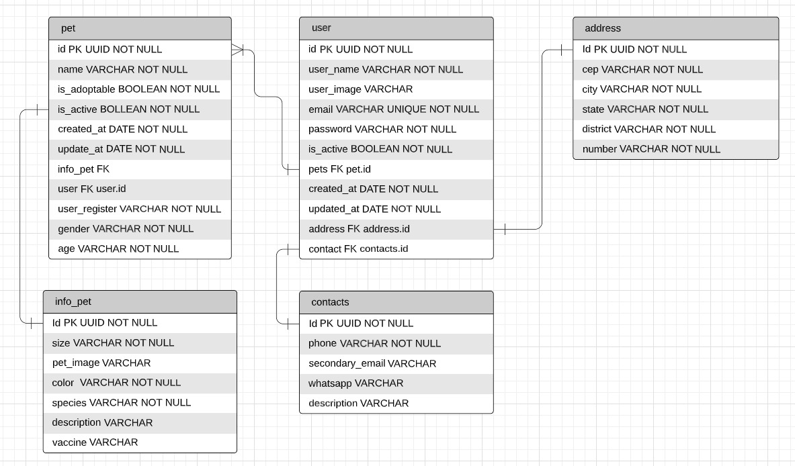

# Documentação da API

## Tabela de Conteúdos

- [Documentação da API](#documentação-da-api)
  - [Tabela de Conteúdos](#tabela-de-conteúdos)
  - [1. Visão Geral](#1-visão-geral)
  - [2. Diagrama ER](#2-diagrama-er)
  - [3. Início Rápido](#3-início-rápido)
    - [3.1. Instalando Dependências](#31-instalando-dependências)
    - [3.2. Variáveis de Ambiente](#32-variáveis-de-ambiente)
    - [3.3. Migrations](#33-migrations)
  - [4. Autenticação](#4-autenticação)
  - [5. Endpoints](#5-endpoints)
    - [Índice](#índice)
  - [1. **Users**](#1-users)
    - [Endpoints](#endpoints)
    - [1.1. **Criação de Usuário**](#11-criação-de-usuário)
    - [`/users`](#users)
    - [Exemplo de Request:](#exemplo-de-request)
    - [Corpo da Requisição:](#corpo-da-requisição)
    - [Schema de Validação com Yup:](#schema-de-validação-com-yup)
    - [Exemplo de Response:](#exemplo-de-response)
    - [Possíveis Erros:](#possíveis-erros)
    - [1.2. **Login do usuário**](#12-login-do-usuário)
    - [Exemplo de Request:](#exemplo-de-request-1)
    - [Corpo da Requisição:](#corpo-da-requisição-1)
    - [Exemplo de Response:](#exemplo-de-response-1)
    - [Possíveis Erros:](#possíveis-erros-1)
    - [1.3. **Listando Usuários**](#13-listando-usuários)
    - [`/users`](#users-1)
    - [Exemplo de Request:](#exemplo-de-request-2)
    - [Corpo da Requisição:](#corpo-da-requisição-2)
    - [Exemplo de Response:](#exemplo-de-response-2)
    - [Possíveis Erros:](#possíveis-erros-2)
    - [1.4. **Listando Usuário**](#14-listando-usuário)
    - [`/user`](#user)
    - [Exemplo de Request:](#exemplo-de-request-3)
    - [Corpo da Requisição:](#corpo-da-requisição-3)
    - [Exemplo de Response:](#exemplo-de-response-3)
    - [Possíveis Erros:](#possíveis-erros-3)
    - [1.5. **Atualização do usuário**](#15-atualização-do-usuário)
    - [`/users`](#users-2)
    - [Exemplo de Request:](#exemplo-de-request-4)
    - [Corpo da Requisição:](#corpo-da-requisição-4)
    - [Exemplo de Response:](#exemplo-de-response-4)
    - [Possíveis Erros:](#possíveis-erros-4)
    - [1.6. **SoftDelete do usuário**](#16-softdelete-do-usuário)
    - [`/users`](#users-3)
    - [Exemplo de Request:](#exemplo-de-request-5)
    - [Corpo da Requisição:](#corpo-da-requisição-5)
    - [Exemplo de Response:](#exemplo-de-response-5)
    - [Possíveis Erros:](#possíveis-erros-5)
  - [2. **Pets**](#2-pets)
    - [Endpoints](#endpoints-1)
    - [2.1. **Criação de um pet**](#21-criação-de-um-pet)
    - [`/pet`](#pet)
    - [Exemplo de Request:](#exemplo-de-request-6)
    - [Corpo da Requisição:](#corpo-da-requisição-6)
    - [Exemplo de Response:](#exemplo-de-response-6)
    - [Possíveis Erros:](#possíveis-erros-6)
    - [2.2. **Listar todos os pets**](#22-listar-todos-os-pets)
    - [`/pet`](#pet-1)
    - [Exemplo de Request:](#exemplo-de-request-7)
    - [Corpo da Requisição:](#corpo-da-requisição-7)
    - [Exemplo de Response:](#exemplo-de-response-7)
    - [Possíveis Erros:](#possíveis-erros-7)
    - [2.3. **Lista os pets disponíveis para adoção**](#23-lista-os-pets-disponíveis-para-adoção)
    - [`/pet`](#pet-2)
    - [Exemplo de Request:](#exemplo-de-request-8)
    - [Corpo da Requisição:](#corpo-da-requisição-8)
    - [Exemplo de Response:](#exemplo-de-response-8)
    - [Possíveis Erros:](#possíveis-erros-8)
    - [2.4. **Adotar um pet**](#24-adotar-um-pet)
    - [`/pet`](#pet-3)
    - [Exemplo de Request:](#exemplo-de-request-9)
    - [Corpo da Requisição:](#corpo-da-requisição-9)
    - [Exemplo de Response:](#exemplo-de-response-9)
    - [Possíveis Erros:](#possíveis-erros-9)
    - [2.5. **Atualizar dados do pet**](#25-atualizar-dados-do-pet)
    - [`/pet`](#pet-4)
    - [Exemplo de Request:](#exemplo-de-request-10)
    - [Corpo da Requisição:](#corpo-da-requisição-10)
    - [Schema de Validação com Yup:](#schema-de-validação-com-yup-1)
    - [Exemplo de Response:](#exemplo-de-response-10)
    - [Possíveis Erros:](#possíveis-erros-10)
    - [2.6. **SoftDelete do pet**](#26-softdelete-do-pet)
    - [`/pet`](#pet-5)
    - [Exemplo de Request:](#exemplo-de-request-11)
    - [Corpo da Requisição:](#corpo-da-requisição-11)
    - [Exemplo de Response:](#exemplo-de-response-11)
    - [Possíveis Erros:](#possíveis-erros-11)

---

## 1. Visão Geral

Visão geral do projeto, um pouco das tecnologias usadas.

- [NodeJS](https://nodejs.org/en/)
- [Express](https://expressjs.com/pt-br/)
- [TypeScript](https://www.typescriptlang.org/)
- [PostgreSQL](https://www.postgresql.org/)
- [TypeORM](https://typeorm.io/)
- [Yup](https://www.npmjs.com/package/yup)

A URL base da aplicação:
https://mais-que-um-pet.herokuapp.com

---

## 2. Diagrama ER

[ Voltar para o topo ](#tabela-de-conteúdos)

Diagrama ER da API definindo bem as relações entre as tabelas do banco de dados.



---

## 3. Início Rápido

[ Voltar para o topo ](#tabela-de-conteúdos)

### 3.1. Instalando Dependências

Clone o projeto em sua máquina e instale as dependências com o comando:

```shell
yarn
```

### 3.2. Variáveis de Ambiente

Em seguida, crie um arquivo **.env**, copiando o formato do arquivo **.env.example**:

```
cp .env.example .env
```

Configure suas variáveis de ambiente com suas credenciais do Postgres e uma nova database da sua escolha.

### 3.3. Migrations

Execute as migrations com o comando:

```
yarn typeorm migration:run -d src/database/data-source.ts
```

---

## 4. Autenticação

[ Voltar para o topo ](#tabela-de-conteúdos)

```
Authorization: Bearer token
```

---

## 5. Endpoints

[ Voltar para o topo ](#tabela-de-conteúdos)

### Índice

- [Users](#1-users)
  - [POST - /users](#11-criação-de-usuário)
  - [POST - /login](#12-login-do-usuário)
  - [GET - /users](#13-listar-usuários)
  - [PATCH - /users/:id](#13-atualiza-dados-do-usuário)
  - [DELETE - /users:id](#13-softdelete-do-usuário)
- [Pets](#2-pets)
  - [POST - /pets](#21-criação-de-pet)
  - [GET - /pets](#22-listando-pets)

---

## 1. **Users**

[ Voltar para os Endpoints ](#5-endpoints)

O objeto User é definido como:

| Campo      | Tipo    | Descrição                                  |
| ---------- | ------- | ------------------------------------------ |
| id         | string  | Identificador único do usuário             |
| user_name  | string  | O nome do usuário.                         |
| user_image | string  | Url da imagem do perfil do usuário         |
| email      | string  | O e-mail do usuário.                       |
| password   | string  | A senha de acesso do usuário               |
| is_active  | Boolean | Informa se a conta está ativa              |
| pets       | Array   | Array de pets do usuário                   |
| created_at | date    | Data de cadastro do usuário                |
| updated_at | date    | Data de atualização do perfil do usuário   |
| address    | Address | Objeto Address, define endereço do usuário |
| contact    | Contact | Objeto Contact, define contatos do usuário |

### Endpoints

| Método | Rota       | Descrição                 |
| ------ | ---------- | ------------------------- |
| POST   | /users     | Criação de um usuário.    |
| POST   | /login     | Login do usuário.         |
| GET    | /users     | Lista todos os usuários   |
| GET    | /user      | Lista um usuário          |
| PATCH  | /users/:id | Atualiza dados do usuário |
| DELETE | /users/:id | SoftDelete do usuário     |

---

### 1.1. **Criação de Usuário**

[ Voltar para os Endpoints ](#5-endpoints)

### `/users`

### Exemplo de Request:

```
POST /users
Host: https://mais-que-um-pet.herokuapp.com
Authorization: None
Content-type: application/json
```

### Corpo da Requisição:

```json
{
  "user_name": "adm",
  "user_image": "url_image",
  "email": "adm@mail.com",
  "password": "1234",
  "address": {
    "cep": "12345678",
    "city": "Recife",
    "district": "Nova Decoberta",
    "number": "10",
    "state": "PE"
  },
  "contact": {
    "description": "",
    "phone": "81991919191",
    "secondary_email": "adm2@mail.com",
    "whatsapp": "81993939393"
  }
}
```

### Schema de Validação com Yup:

```javascript
  user_name: yup.string().required(),
  user_image: yup
    .string()
    .notRequired()
    .default(() => ""),
  email: yup
    .string()
    .email()
    .required()
    .transform((value: string, originalValue: string) => {
      return originalValue.toLowerCase();
    }),
  password: yup
    .string()
    .required()
    .transform((value: string, originalValue: string) => {
      return bcrypt.hashSync(originalValue, 10);
    }),
  address: yup.object().shape({
    cep: yup.string().required(),
    city: yup.string().required(),
    district: yup.string().required(),
    number: yup.string().required(),
    state: yup.string().required(),
  }),
  contact: yup.object().shape({
    description: yup
      .string()
      .notRequired()
      .default(() => ""),
    phone: yup
      .string()
      .notRequired()
      .default(() => ""),
    secondary_email: yup
      .string()
      .notRequired()
      .default(() => ""),
    whatsapp: yup
      .string()
      .notRequired()
      .default(() => "")
```

OBS.: Chaves não presentes no schema serão removidas.

### Exemplo de Response:

```
201 Created
```

```json
{
  "id": "22f55f79-0a33-4af5-b7fb-f20e41c1ceed",
  "user_name": "adm",
  "user_image": "adm_image",
  "email": "adm@mail.com",
  "is_active": true,
  "address": {
    "cep": "12345678",
    "city": "Recife",
    "district": "Nova Decoberta",
    "number": "10",
    "state": "PE",
    "id": "dd032196-339a-4a20-a7ee-8c5c72f17611"
  },
  "contact": {
    "description": "uma breve descrição",
    "phone": "81991919191",
    "secondary_email": "adm2@mail.com",
    "whatsapp": "81993939393",
    "id": "8a3cfb25-3f75-4534-8d8f-cc736aa9a690"
  },
  "pets": [],
  "created_at": "2022-11-04T16:13:46.493Z",
  "updated_at": "2022-11-04T16:13:46.493Z"
}
```

### Possíveis Erros:

| Código do Erro  | Descrição             |
| --------------- | --------------------- |
| 400 Bad request | Email already exists. |

---

### 1.2. **Login do usuário**

[ Voltar aos Endpoints ](#5-endpoints)

### Exemplo de Request:

```
POST /login
Host: https://mais-que-um-pet.herokuapp.com
Authorization: None
Content-type: application/json
```

### Corpo da Requisição:

```json
{
  "email": "adm@mail.com",
  "password": "1234"
}
```

### Exemplo de Response:

```
200 OK
```

```json
[
  {
    "token": "token-de-login"
  }
]
```

### Possíveis Erros:

| Código do Erro  | Descrição                   |
| --------------- | --------------------------- |
| 400 Bad request | email/password is required. |
| 403 forbidden   | Wrong email/password.       |

---

### 1.3. **Listando Usuários**

[ Voltar aos Endpoints ](#5-endpoints)

### `/users`

### Exemplo de Request:

```

GET /users
Host: https://mais-que-um-pet.herokuapp.com
Authorization: None
Content-type: application/json

```

### Corpo da Requisição:

```json
Vazio
```

### Exemplo de Response:

```
200 OK
```

```json
[
  {
    "id": "22f55f79-0a33-4af5-b7fb-f20e41c1ceed",
    "user_name": "adm",
    "user_image": "jubfjsdbds",
    "email": "adm@mail.com",
    "is_active": true,
    "address": {
      "cep": "12345678",
      "city": "Recife",
      "district": "Nova Decoberta",
      "number": "10",
      "state": "PE",
      "id": "dd032196-339a-4a20-a7ee-8c5c72f17611"
    },
    "contact": {
      "description": "uma breve descrição",
      "phone": "81991919191",
      "secondary_email": "adm2@mail.com",
      "whatsapp": "81993939393",
      "id": "8a3cfb25-3f75-4534-8d8f-cc736aa9a690"
    },
    "pets": [],
    "created_at": "2022-11-04T16:13:46.493Z",
    "updated_at": "2022-11-04T16:13:46.493Z"
  }
]
```

### Possíveis Erros:

Nenhum, o máximo que pode acontecer é retornar uma lista vazia.

---

### 1.4. **Listando Usuário**

[ Voltar aos Endpoints ](#5-endpoints)

### `/user`

### Exemplo de Request:

```

GET /user
Host: https://mais-que-um-pet.herokuapp.com
Authorization: Bearer token
Content-type: application/json

```

### Corpo da Requisição:

```json
Vazio
```

### Exemplo de Response:

```
200 OK
```

```json
{
  "id": "22f55f79-0a33-4af5-b7fb-f20e41c1ceed",
  "user_name": "Adm",
  "user_image": "jubfjsdbds",
  "email": "adm@mail.com",
  "is_active": true,
  "address": {
    "cep": "12345678",
    "city": "Recife",
    "district": "Nova Decoberta",
    "number": "10",
    "state": "PE",
    "id": "dd032196-339a-4a20-a7ee-8c5c72f17611"
  },
  "contact": {
    "description": "uma breve descrição",
    "phone": "81991919191",
    "secondary_email": "adm2@mail.com",
    "whatsapp": "81993939393",
    "id": "8a3cfb25-3f75-4534-8d8f-cc736aa9a690"
  },
  "pets": [],
  "created_at": "2022-11-04T16:13:46.493Z",
  "updated_at": "2022-11-04T16:13:46.493Z"
}
```

### Possíveis Erros:

| Código do Erro | Descrição       |
| -------------- | --------------- |
| 404 Not Found  | User not found. |

---

### 1.5. **Atualização do usuário**

[ Voltar aos Endpoints ](#5-endpoints)

### `/users`

```
Pode ser atualizado o user_name, user_image, email e password.
```

### Exemplo de Request:

```

PATCH /users/:id
Host: https://mais-que-um-pet.herokuapp.com
Authorization: Bearer token
Content-type: application/json

```

### Corpo da Requisição:

```json
{
  "user_name": "adm",
  "user_image": "url_da_imagem",
  "email": "adm@mail.com",
  "password": "12345"
}
```

### Exemplo de Response:

```
200 OK
```

```json
{
  "message": "User updated!",
  "updatedUser": {
    "id": "22f55f79-0a33-4af5-b7fb-f20e41c1ceed",
    "user_image": "url_da_imagem",
    "user_name": "adm",
    "email": "adm@mail.com",
    "password": "$2b$10$3dmTSKOWBQp4zPp./VmQ7uKVsuWvlhFTQTkPJLmloAvF64POC9gDu",
    "is_active": true,
    "created_at": "2022-11-04T16:13:46.493Z",
    "updated_at": "2022-11-07T14:24:20.584Z",
    "pets": [],
    "address": {
      "id": "dd032196-339a-4a20-a7ee-8c5c72f17611",
      "cep": "12345678",
      "city": "Recife",
      "state": "PE",
      "district": "Nova Decoberta",
      "number": "10"
    },
    "contact": {
      "id": "8a3cfb25-3f75-4534-8d8f-cc736aa9a690",
      "phone": "81991919191",
      "secondary_email": "adm2@mail.com",
      "whatsapp": "81993939393",
      "description": "uma breve descrição"
    }
  }
}
```

### Possíveis Erros:

| Código do Erro   | Descrição                             |
| ---------------- | ------------------------------------- |
| 400 Bad request  | missing authorization token..         |
| 403 forbidden    | Invalid token.                        |
| 401 unauthorized | Is not able to update isActive value. |
| 401 unauthorized | Is not able to update id.             |
| 404 not found    | User not found.                       |

---

### 1.6. **SoftDelete do usuário**

[ Voltar aos Endpoints ](#5-endpoints)

### `/users`

### Exemplo de Request:

```

DELETE /users/:id
Host: https://mais-que-um-pet.herokuapp.com
Authorization: Bearer token
Content-type: application/json

```

### Corpo da Requisição:

```json
Vazio
```

### Exemplo de Response:

```
204 OK
```

```json
Vazio
```

### Possíveis Erros:

| Código do Erro   | Descrição                     |
| ---------------- | ----------------------------- |
| 400 Bad request  | missing authorization token.. |
| 403 forbidden    | Invalid token.                |
| 404 not found    | User not found.               |
| 401 unauthorized | User is not active.           |

---

## 2. **Pets**

[ Voltar para os Endpoints ](#5-endpoints)

O objeto User é definido como:

| Campo         | Tipo     | Descrição                               |
| ------------- | -------- | --------------------------------------- |
| id            | string   | Identificador único do usuário          |
| name          | string   | O nome do pet.                          |
| is_adoptable  | boolean  | Informa se o pet pode ser adotado       |
| is_active     | Boolean  | Softdelete do pet                       |
| created_at    | date     | Data de cadastro do pet                 |
| age           | string   | Idade do pet.                           |
| gender        | string   | Sexo do pet.                            |
| updated_at    | date     | Data de atualização do pet              |
| info_pet      | Info_pet | Objeto Info_pet, informações do pet     |
| user          | User     | Objeto User, define usuário dono do pet |
| user_register | string   | id do usuário doador do pet             |

### Endpoints

| Método | Rota           | Descrição                             |
| ------ | -------------- | ------------------------------------- |
| POST   | /pet           | Criação de um pet                     |
| GET    | /pet           | Lista todos os pets                   |
| GET    | /pet/adoptable | Lista os pets disponíveis para adoção |
| PATCH  | /pet/adopt/:id | Adotar um pet                         |
| PATCH  | /pet/:id       | Atualiza dados do pet                 |
| DELETE | /pet/:id       | SoftDelete do pet                     |

---

### 2.1. **Criação de um pet**

[ Voltar para os Endpoints ](#5-endpoints)

### `/pet`

### Exemplo de Request:

```
POST /pet
Host: https://mais-que-um-pet.herokuapp.com
Authorization: Bearer token
Content-type: application/json
```

### Corpo da Requisição:

```json
{
  "name": "Viola",
  "is_adoptable": true,
  "is_active": true,
  "gender": "female",
  "age": "5",
  "info_pet": {
    "pet_image": "",
    "size": "médio porte",
    "color": "Caramelo universal",
    "species": "Vira-Lata",
    "description": "Cadelinha de 7 anos muito tranquila e parceira",
    "vaccine": "todas"
  }
}
```

### Exemplo de Response:

```
201 Created
```

```json
{
  "name": "Viola2",
  "is_adoptable": true,
  "is_active": true,
  "gender": "female",
  "age": "5",
  "info_pet": {
    "pet_image": "viola2",
    "size": "médio porte",
    "color": "Caramelo universal",
    "species": "Vira-Lata",
    "description": "Cadelinha de 7 anos muito tranquila e parceira",
    "vaccine": "todas",
    "id": "20d65cdd-6101-4949-8d4c-c52fadd87fe9"
  },
  "user_register": "96a10907-638b-42d8-a4eb-22dba8b22813",
  "id": "76e1e904-de35-428d-95b4-eb63bf014b24",
  "created_at": "2022-11-07T19:20:48.930Z",
  "updated_at": "2022-11-07T19:20:48.930Z"
}
```

### Possíveis Erros:

| Código do Erro  | Descrição                       |
| --------------- | ------------------------------- |
| 400 Bad request | missing authorization token.    |
| 403 forbidden   | Invalid token.                  |
| 400 Bad request | This pet is already registered. |

---

### 2.2. **Listar todos os pets**

[ Voltar para os Endpoints ](#5-endpoints)

### `/pet`

### Exemplo de Request:

```
GET /pet
Host: https://mais-que-um-pet.herokuapp.com
Authorization: None
Content-type: application/json
```

### Corpo da Requisição:

```json
Vazio
```

### Exemplo de Response:

```
200 Ok
```

```json
[
  {
    "id": "a36dadeb-7d9e-4d7a-8fd2-02d39f2d58ef",
    "name": "Viola",
    "is_adoptable": false,
    "is_active": true,
    "gender": "female",
    "age": "5",
    "created_at": "2022-11-07T16:04:00.405Z",
    "updated_at": "2022-11-07T16:13:08.903Z",
    "user_register": "96a10907-638b-42d8-a4eb-22dba8b22813",
    "info_pet": {
      "id": "45769796-fc6f-46d0-8470-b815707c7cbd",
      "pet_image": "",
      "size": "médio porte",
      "color": "Caramelo universal",
      "species": "Vira-Lata",
      "description": "Cadelinha de 7 anos muito tranquila e parceira",
      "vaccine": "todas"
    }
  }
]
```

### Possíveis Erros:

Nenhum, o máximo que pode acontecer é retornar uma lista vazia.

---

### 2.3. **Lista os pets disponíveis para adoção**

[ Voltar para os Endpoints ](#5-endpoints)

### `/pet`

### Exemplo de Request:

```
GET /pet/adoptable
Host: https://mais-que-um-pet.herokuapp.com
Authorization: None
Content-type: application/json
```

### Corpo da Requisição:

```json
Vazio
```

### Exemplo de Response:

```
200 Ok
```

```json
[
  {
    "id": "76e1e904-de35-428d-95b4-eb63bf014b24",
    "name": "Viola2",
    "is_adoptable": true,
    "is_active": true,
    "gender": "female",
    "age": "5",
    "created_at": "2022-11-07T19:20:48.930Z",
    "updated_at": "2022-11-07T19:20:48.930Z",
    "user_register": "96a10907-638b-42d8-a4eb-22dba8b22813",
    "info_pet": {
      "id": "20d65cdd-6101-4949-8d4c-c52fadd87fe9",
      "pet_image": "viola2",
      "size": "médio porte",
      "color": "Caramelo universal",
      "species": "Vira-Lata",
      "description": "Cadelinha de 7 anos muito tranquila e parceira",
      "vaccine": "todas"
    }
  }
]
```

### Possíveis Erros:

Nenhum, o máximo que pode acontecer é retornar uma lista vazia.

---

### 2.4. **Adotar um pet**

[ Voltar para os Endpoints ](#5-endpoints)

### `/pet`

### Exemplo de Request:

```
Deve ser passado o id do pet na url da requisição
```

```
PATCH /pet/adopt/:id
Host: https://mais-que-um-pet.herokuapp.com
Authorization: Bearer token
Content-type: application/json
```

### Corpo da Requisição:

```json
{
  "email": "emaildodonatario@mail.com"
}
```

### Exemplo de Response:

```
200 Ok
```

```json
{
  "message": "Pet Adopted",
  "user": "adm",
  "pet": {
    "name": "Viola2",
    "is_adoptable": false
  }
}
```

### Possíveis Erros:

| Código do Erro  | Descrição                    |
| --------------- | ---------------------------- |
| 400 Bad request | missing authorization token. |
| 403 forbidden   | Invalid token.               |
| 400 Bad request | Pet not found.               |
| 400 Bad request | Can't adopt this pet.        |
| 400 Bad request | You do not have permission   |
| 400 Bad request | User not found.              |

---

### 2.5. **Atualizar dados do pet**

[ Voltar para os Endpoints ](#5-endpoints)

### `/pet`

```
Pode ser atualizado o name, size, pet_image, description e vaccine, age.
```

### Exemplo de Request:

```
PATCH /pet/:id
Host: https://mais-que-um-pet.herokuapp.com
Authorization: Bearer token
Content-type: application/json
```

### Corpo da Requisição:

```json
{
  "name": "Coragem",
  "size": "pequeno_porte",
  "pet_image": "nova_url",
  "description": "nova descrição",
  "vaccine": "valmec",
  "age": "5"
}
```

### Schema de Validação com Yup:

```javascript
  name: yup.string().notRequired(),
  description: yup.string().notRequired(),
  pet_image: yup.string().notRequired(),
  size: yup.string().notRequired(),
  vaccine: yup.string().notRequired(),
  age: yup.string().notRequired()
```

OBS.: Chaves não presentes no schema serão removidas.

### Exemplo de Response:

```
200 Ok
```

```json
{
  "message": "Pet updated",
  "pet_update": {
    "id": "f9814fb6-1afe-467f-a5df-758f199c1c3b",
    "name": "Coragem",
    "is_adoptable": true,
    "is_active": true,
    "gender": "female",
    "age": "5",
    "created_at": "2022-11-08T04:20:13.494Z",
    "updated_at": "2022-11-08T04:22:25.493Z",
    "user_register": "be9c4637-651f-4d1d-aab4-c11258bb741d",
    "info_pet": {
      "id": "6e6adf7a-3d81-48e8-8f3e-9244f473b47e",
      "pet_image": "nova_url",
      "size": "pequeno_porte",
      "color": "Caramelo universal",
      "species": "Vira-Lata",
      "description": "nova descrição",
      "vaccine": "valmec"
    }
  }
}
```

### Possíveis Erros:

| Código do Erro   | Descrição                    |
| ---------------- | ---------------------------- |
| 400 Bad request  | missing authorization token. |
| 403 forbidden    | Invalid token.               |
| 404 not found    | Pet not found.               |
| 401 Unauthorized | Unauthorized.                |
| 404 not found    | infoPets not found           |

---

### 2.6. **SoftDelete do pet**

[ Voltar aos Endpoints ](#5-endpoints)

### `/pet`

### Exemplo de Request:

```

DELETE /pet/:id
Host: https://mais-que-um-pet.herokuapp.com
Authorization: Bearer token
Content-type: application/json

```

### Corpo da Requisição:

```json
Vazio
```

### Exemplo de Response:

```
204 OK
```

```json
{
  "message": "pet Deleted"
}
```

### Possíveis Erros:

| Código do Erro  | Descrição                     |
| --------------- | ----------------------------- |
| 400 Bad request | missing authorization token.. |
| 403 forbidden   | Invalid token.                |
| 404 not found   | Pet not found.                |

---
